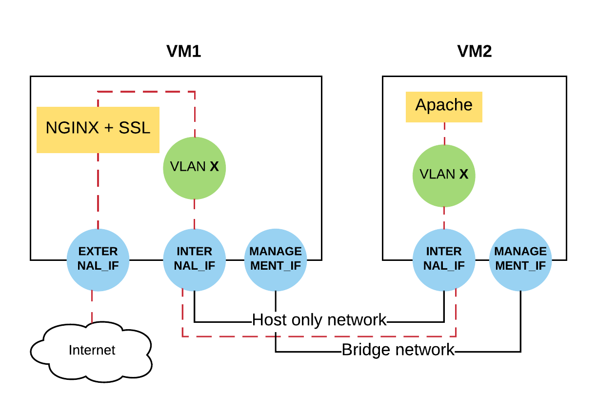

# Task 6.7 — VM Network Topology

## Overview

A pair of bash scripts that configure a two-VM network topology: VM1 acts as a NAT gateway and SSL-terminating nginx reverse proxy; VM2 runs an Apache web server accessible only through a VLAN subinterface. Internet access from VM2 is routed through VM1.



---

## Topology

**VM1** has three network interfaces:

| Interface | Type | Purpose |
|---|---|---|
| External | NAT / Bridged | Internet access |
| Internal | Host-only | Communication with VM2 |
| MGMT | Bridged | Remote management from host |

**VM2** has two network interfaces:

| Interface | Type | Purpose |
|---|---|---|
| Internal | Host-only | Communication with VM1 |
| MGMT | Bridged | Remote management from host |

Internet traffic from VM2 is NATed through VM1's External interface.

---

## Files

| File | Description |
|---|---|
| `vm1.sh` | Configures VM1 networking, NAT, SSL certificates, and nginx |
| `vm1.config` | Network parameters for VM1 |
| `vm2.sh` | Configures VM2 networking and Apache |
| `vm2.config` | Network parameters for VM2 |

---

## Configuration Files

### `vm1.config`

```
EXTERNAL_IF="ens3"       # External interface name
INTERNAL_IF="ens4"       # Internal (host-only) interface name
MANAGEMENT_IF="ens5"     # Management interface name (not configured by script)
VLAN=278                 # VLAN ID for the internal subinterface
EXT_IP="DHCP"            # or a static pair: EXT_IP=172.16.1.1/24 + EXT_GW=172.16.1.254
INT_IP=10.0.0.1/24       # IP for the internal interface
VLAN_IP=10.1.0.1/24      # IP for the VLAN subinterface (e.g. ens4.278)
NGINX_PORT=443           # Port nginx listens on
APACHE_VLAN_IP=10.1.0.2  # VM2 VLAN IP — nginx proxies requests here
```

### `vm2.config`

```
INTERNAL_IF="ens3"          # Internal (host-only) interface name
MANAGEMENT_IF="ens4"        # Management interface name (not configured by script)
VLAN=278                    # VLAN ID for the internal subinterface
APACHE_VLAN_IP=10.1.0.2/24  # IP for the VLAN subinterface (e.g. ens3.278)
INT_IP=10.0.0.2/24          # IP for the internal interface
GW_IP=10.0.0.1              # Default gateway — VM1's internal interface IP
```

The VLAN subinterface name is derived from the template `<INTERNAL_IF>.<VLAN>`. For example, with `INTERNAL_IF="ens4"` and `VLAN=278`, the subinterface is named `ens4.278`.

---

## Scripts

### `vm1.sh`

1. Sources variables from `vm1.config`.
2. Writes `/etc/network/interfaces`:
   - **External** interface — DHCP if `EXT_IP=DHCP`, otherwise static with `EXT_IP` / `EXT_GW`.
   - **Internal** interface — static `INT_IP`.
   - **VLAN subinterface** `<INTERNAL_IF>.<VLAN>` — static `VLAN_IP`.
3. Installs the `vlan` package and creates the VLAN subinterface with `vconfig`.
4. Enables IPv4 forwarding and configures iptables NAT so that VM2 can reach the internet through VM1's External interface.
5. Generates SSL certificates:
   - Root CA → `/etc/ssl/certs/root-ca.crt`
   - Web certificate signed by the root CA, for hostname `vm1`, with the External IP in `subjectAltName` → `/etc/ssl/certs/web.crt` (full chain: web cert + root CA appended)
6. Installs `nginx` and configures it as an HTTPS-only SSL termination proxy:
   - Listens exclusively on `<EXT_IP>:<NGINX_PORT>`; HTTP connections on port 80 are dropped.
   - Proxies all requests to `<APACHE_VLAN_IP>:80` on VM2 over the VLAN subinterface.

### `vm2.sh`

1. Sources variables from `vm2.config`.
2. Writes `/etc/network/interfaces`:
   - **Internal** interface — static `INT_IP` with `GW_IP` as the default gateway.
   - **VLAN subinterface** `<INTERNAL_IF>.<VLAN>` — static `APACHE_VLAN_IP`.
3. Installs the `vlan` package and creates the VLAN subinterface with `vconfig`.
4. Sets the default route via `GW_IP` and configures DNS resolvers.
5. Installs `apache2` and configures it to listen **only** on `APACHE_VLAN_IP:80` — not on all interfaces.

---

## Additional Requirements

1. Internet access from VM2 must be routed through VM1. The gateway is defined by `GW_IP` in `vm2.config`.
2. MGMT interfaces are configured automatically during verification — the scripts must **not** touch `MANAGEMENT_IF`.
3. All variables in `vm*.config` must be sourced (exported) by the corresponding `vm*.sh` scripts.
4. The repository must be named **`task6_7`**.
5. The repository root must contain exactly four files: `vm1.sh`, `vm1.config`, `vm2.sh`, `vm2.config`.

---

## Environment Setup Guide

This section describes how to spin up a local Ubuntu 16.04 environment that matches the grader's setup so you can verify the solution before submission.

### Option A — Docker (recommended, works on Windows / macOS / Linux)

**Prerequisites:** Docker Desktop installed and running.

```bash
# 1. Pull the Ubuntu 16.04 image
docker pull ubuntu:16.04

# 2. Start a privileged container (required for network configuration)
docker run -it --privileged --name topo-vm1 ubuntu:16.04 /bin/bash
```

Inside the container:

```bash
# 3. Install prerequisites
apt-get update && apt-get install -y git net-tools iproute2

# 4. Clone the repository (replace with your actual URL)
git clone https://github.com/<your-username>/task6_7 /root/task6_7
cd /root/task6_7

# 5. Edit vm1.config to match the container's interface names
#    Use `ip link` to list available interfaces

# 6. Run the VM1 configuration script
bash vm1.sh

# 7. Verify nginx is running and the certificate chain is valid
systemctl status nginx
curl -k https://localhost:<NGINX_PORT>
openssl verify -CAfile /etc/ssl/certs/root-ca.crt /etc/ssl/certs/web.crt
```

To re-use the container later:

```bash
docker start -ai topo-vm1
```

To start fresh:

```bash
docker rm topo-vm1
```

Repeat the same steps in a second container (`--name topo-vm2`) running `vm2.sh` for VM2 testing.

---

### Option B — Vagrant (closer to bare-metal)

**Prerequisites:** [VirtualBox](https://www.virtualbox.org/) and [Vagrant](https://www.vagrantup.com/) installed.

Create a `Vagrantfile` in any working directory:

```ruby
Vagrant.configure("2") do |config|
  config.vm.define "vm1" do |vm1|
    vm1.vm.box = "ubuntu/xenial64"
    vm1.vm.network "private_network", type: "dhcp"
    vm1.vm.provision "shell", inline: <<-SHELL
      apt-get update && apt-get install -y git
      git clone https://github.com/<your-username>/task6_7 /root/task6_7
      cd /root/task6_7 && bash vm1.sh
    SHELL
  end

  config.vm.define "vm2" do |vm2|
    vm2.vm.box = "ubuntu/xenial64"
    vm2.vm.network "private_network", type: "dhcp"
    vm2.vm.provision "shell", inline: <<-SHELL
      apt-get update && apt-get install -y git
      git clone https://github.com/<your-username>/task6_7 /root/task6_7
      cd /root/task6_7 && bash vm2.sh
    SHELL
  end
end
```

```bash
# Start both VMs
vagrant up

# SSH into VM1
vagrant ssh vm1

# SSH into VM2
vagrant ssh vm2
```

---

## Verification Checklist

| Check | Command | Expected result |
|---|---|---|
| nginx is running | `systemctl status nginx` | `active (running)` |
| nginx listens on correct address | `ss -tlnp \| grep nginx` | Shows `<EXT_IP>:<NGINX_PORT>` |
| HTTPS request returns Apache page | `curl -k https://<EXT_IP>:<NGINX_PORT>` | Apache default page |
| Root CA validates web certificate | `openssl verify -CAfile /etc/ssl/certs/root-ca.crt /etc/ssl/certs/web.crt` | `web.crt: OK` |
| SAN contains External IP | `openssl x509 -in /etc/ssl/certs/web.crt -text -noout \| grep -A1 "Subject Alternative"` | Shows External IP |
| Full certificate chain is served | `openssl x509 -in /etc/ssl/certs/web.crt -text -noout \| grep Issuer` | Matches root CA CN |
| HTTP is blocked | `curl http://<EXT_IP>:80` | Connection refused / no response |
| VM1 VLAN subinterface is up | `ip addr show <INTERNAL_IF>.<VLAN>` | Shows `VLAN_IP` |
| apache2 is running | `systemctl status apache2` | `active (running)` |
| Apache listens only on VLAN IP | `ss -tlnp \| grep apache2` | Shows only `<APACHE_VLAN_IP>:80` |
| VM2 VLAN subinterface is up | `ip addr show <INTERNAL_IF>.<VLAN>` | Shows `APACHE_VLAN_IP` |
| VM2 has internet access via VM1 | `curl -s http://example.com` (on VM2) | HTTP response body |

---

## Verification Procedure

### Environment

- **OS:** Ubuntu Xenial 16.04 Server (`xenial-server-cloudimg-amd64-disk1.img`)
- **User:** `root`
- **VM1:** internet access through External interface
- **VM2:** internet access only if correctly routed through VM1

### Execution Order

1. The assignment repository is cloned onto both VMs from `https://github.com/<user>/task6_7`.
2. `vm1.sh` is executed on VM1.
3. `vm2.sh` is executed on VM2.
4. A request is made from the **host** to nginx over HTTPS. The response must be the Apache default page served by VM2. Certificate validity is checked against `/etc/ssl/certs/root-ca.crt` on VM1.

> A repository name other than `task6_7` results in automatic failure.

---

## Expected Behavior

### Successful end-to-end flow

- VM1's External interface is reachable from the host.
- nginx accepts HTTPS connections on `EXT_IP:NGINX_PORT` and presents a certificate signed by the root CA at `/etc/ssl/certs/root-ca.crt`.
- nginx proxies all requests to `APACHE_VLAN_IP:80` on VM2 over the VLAN subinterface.
- Apache on VM2 responds with its default page.
- VM2 can reach the internet via VM1 (NATed through the External interface).

### HTTP access

- All HTTP connections to VM1 on port 80 are dropped — only HTTPS is served.

### VLAN subinterfaces

- Both VMs create a tagged subinterface named `<INTERNAL_IF>.<VLAN>` (e.g. `ens4.278`) using `vconfig`.
- VM1's VLAN IP is `VLAN_IP`; VM2's VLAN IP is `APACHE_VLAN_IP`.
- Apache listens exclusively on VM2's VLAN subinterface IP — not on all interfaces.
